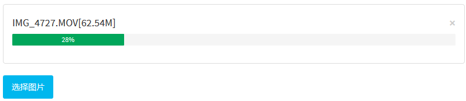

# yii2 fex-webuploader

* 支持分片上传大文件
* 可以开启和关闭分片上传
* 默认只能上传一个文件 文件的服务端存储位置保存在隐藏字段 
* 要上传多个文件，可以通过 clientOptions配置。开启之后，多个文件的服务端存储位置用`,`分隔成一个字符串保存在隐藏字段
* 本模块的UI不具备通用性，只是解决了上传普通文件，上传大文件的问题
* 主要是解决自己项目的业务场景
* 放弃之前的文件处理驱动，使用 [dungang/yii2-file-storage](https://github.com/dungang/yii2-file-storage) 作为文件存储方案的替换




## 使用方法

> 下载验证码包

```

composer require dungang/yii2-fex-webuploader

```

> 配置模块 config/web.php


```
'webuploader'=>[
    'class'=>'dungang\webuploader\Module',
//下面是默认配置    
//    [
        /**
         * @var array 访问角色 默认是登录用户才可以
         */
//        role => ['@'],
         
        /**
         * @var string 上传文件的驱动
         */
//        'driver' => 'dungang\storage\driver\Local',
//        'driver' => [
                'class'=>'dungang\storage\driver\AliYunOSS',
                //Yii::$app->params['oss']
                'paramKey'=>'oss'
            ],
    
        /**
         * @var string 上传文件保存的相对路径
         */
//        'saveDir' => '/upload/webuploader',
    
        /**
         * @var array 接受的文件类型
         */
//        'accept' => ['gif','jpg','png','bmp','docx','doc','ppt','xsl','rar','zip','7z']
//    ]
],
    
```

> 配置widget

```
<?= $form->field($model, 'image')->widget('\dungang\webuploader\widgets\WebUploader',[
    'chunked'=>true
]) ?>

<?= \dungang\webuploader\widgets\WebUploader::widget([
    'chunked'=>true,
    'name' =>'image'
])?>

```

> 配置参数如下

* 根据实际情况选择性配置，默认上传入口时本模块的控制器，也可以同个action配置在自己app的其他的控制器
* 安装上面的安装步骤 就可以很好的工作了


```
    /**
     * @var string 选择按钮的名称
     */
    'pickTitle' => '选择文件',
    
    /**
     * @var string 文件上传入口
     */
    'uploadPoint'=> null,

    /**
     * @var string 删除文件入口
     */
    'delPoint'=>null,

    /**
     * @var bool 是否自动开启上传
     */
    'auto' => true,

    /**
     * @var bool 分片上传大文件
     */
    'chunked' => false,

    /**
     * @var int 上传文件数量限制
     */
    'fileNumLimit' => 1,

    /**
     * @var int 单个文件大小限制
     */
    'fileSingleSizeLimit' => 100 * 1024 * 1024,

    /**
     * @var int 分片的大小
     */
    'chunkSize' => 5 * 1024 * 1024,

    /**
     * @var array 额外的表单数据
     */
    'formData' => [],
    
    /**
     * @var array 初始化 webuploader options
     */
    'clientOptions' => []
```

## 扩展驱动

放弃之前的文件处理驱动，使用 [dungang/yii2-file-storage](https://github.com/dungang/yii2-file-storage) 作为文件存储方案的替换


> 支持事件

Uploader 驱动事件

* ***beforeInitUploader***  在`initUploader`方法调用之前触发
* ***beforeWriteFile*** 在`writeFile`方法调用之前触发
* ***afterWriteFile*** 在`writeFile`方法调用之后触发
* ***beforeDeleteFile*** 在`deleteFile`方法调用之前触发
* ***afterDeleteFile*** 在 `deleteFile` 方法调用之后触发

使用场景

* 使用非本地驱动的时候，如果是成熟项目，以aliyun oss 举例来说，原先的项目的配置的属性`key`
可能和驱动本身要求的`key`的名称不一样这个时候需要在初始化之前获取到原先的配置进行转换成驱动要求的,
则可以绑定 `beforeInitUploader` 事件来处理此工作。
* 比如我们需要上传文件之后，把文件的存储信息保存到数据库，则可以绑定 `afterWriteFile` 事件来处理此工作。
* 比如我们删除文件，要删除对应的数据库信息，则可以绑定 `afterDeleteFile` 事件来处理此工作。


绑定事件的方式，配置行为

```
'webuploader'=>[
    'class'=>'dungang\webuploader\Module',
    [
        'driver' => [
                'class'=>'dungang\webuploader\components\AliYunOSSUploader',
                //Yii::$app->params['oss']
                'paramKey'=>'oss',
                //参考Yii2行为配置
                'as aliyunBehavior'=>'behiaviorClassName'
            ],
    ]
],
```

YII2行为配置的方法

```
[
    'as myBehavior2' => MyBehavior::className(),

    'as myBehavior3' => [
        'class' => MyBehavior::className(),
        'prop1' => 'value1',
        'prop2' => 'value2',
    ],
]
```

## 协议

MIT License

Copyright (c) 2017 dungang

Permission is hereby granted, free of charge, to any person obtaining a copy
of this software and associated documentation files (the "Software"), to deal
in the Software without restriction, including without limitation the rights
to use, copy, modify, merge, publish, distribute, sublicense, and/or sell
copies of the Software, and to permit persons to whom the Software is
furnished to do so, subject to the following conditions:

The above copyright notice and this permission notice shall be included in all
copies or substantial portions of the Software.

THE SOFTWARE IS PROVIDED "AS IS", WITHOUT WARRANTY OF ANY KIND, EXPRESS OR
IMPLIED, INCLUDING BUT NOT LIMITED TO THE WARRANTIES OF MERCHANTABILITY,
FITNESS FOR A PARTICULAR PURPOSE AND NONINFRINGEMENT. IN NO EVENT SHALL THE
AUTHORS OR COPYRIGHT HOLDERS BE LIABLE FOR ANY CLAIM, DAMAGES OR OTHER
LIABILITY, WHETHER IN AN ACTION OF CONTRACT, TORT OR OTHERWISE, ARISING FROM,
OUT OF OR IN CONNECTION WITH THE SOFTWARE OR THE USE OR OTHER DEALINGS IN THE
SOFTWARE.